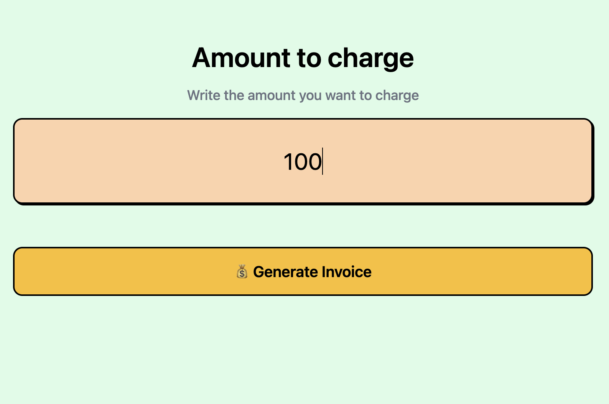
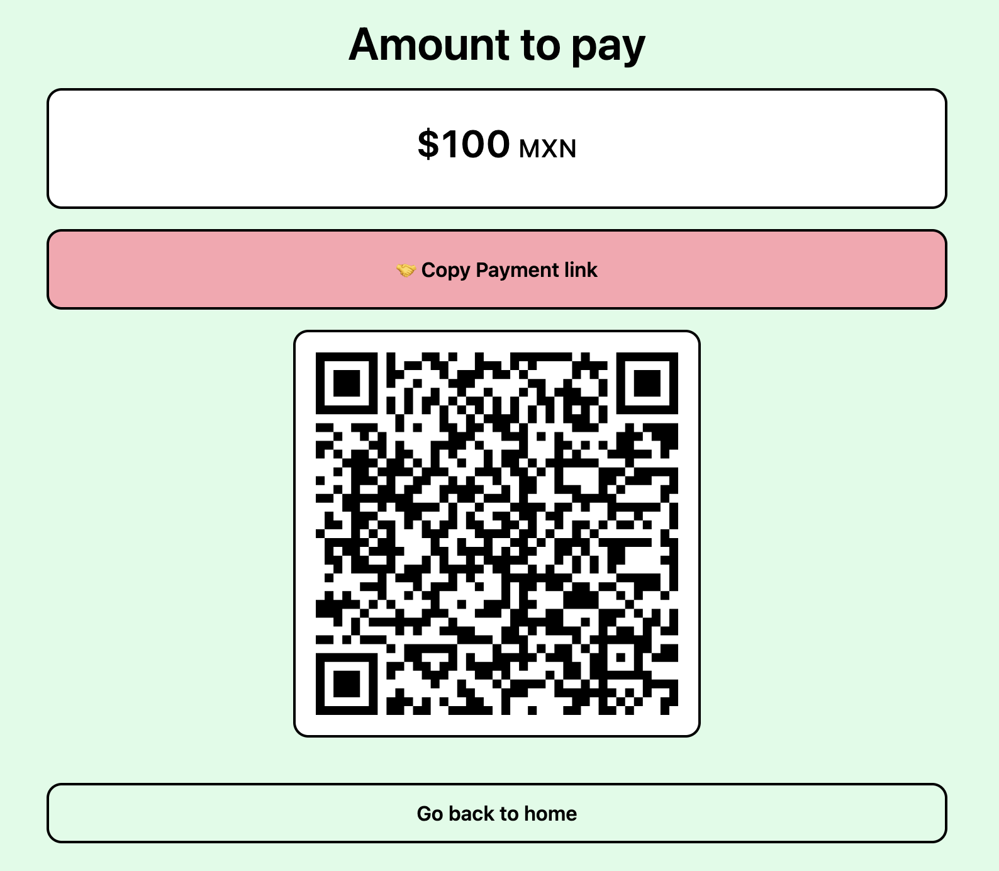
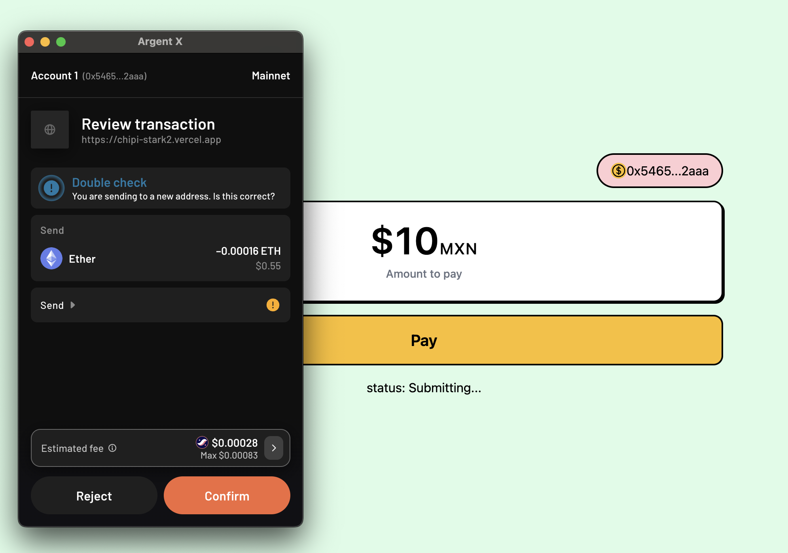

# Chipi Pay v.0.1
The cheapest option in Latin America for digital payments, now in Starknet. Accept crypto currencies with ease and receive your money in your local currency.

We are builders from Mexico City starting our journey to bring web2-ish UX for payments while enharnecing the experience with the cheap transactions of Starknet.

There are 122 M people that remains unbanked in LATAM. Those who the only alternative for their daily transactions is cash. We can encourage them by bringing a cheaper option than Visa/Mastercard to accept digital payments.

## Relevant Links

| What? | Link |
|---|---|
| Test Dapp | https://chipi-stark2.vercel.app/

## How it works?
New users sign-up or connect their self-custodial wallet with funds. They can use any SLP token to pay at every store on the whitelist that accept Chapi Pay without sign transaction. 

### Merchant
1. Enter how much you want to charge in your local currency. 

     
    
     

2. Let the user bring scan the QR to open the payment link. 

     
    
     

3. Now the user can sign in with their Starknet wallet and pay.

     
    
     

4. Receive your money instantly in your local currency 🎉🎉🎉

### User
1. Open the payment link and sign in with your Starknet wallet.
2. Pay with Eth with super low fees thanks to Starknet.

## How does it work?

### Backend calls
1. We have a backend that creates a Starknet wallet with account abstraction
2. The backend handles the withdrawal of the funds from the user wallet to the merchant wallet
3. Thanks to Paymaster, the withdrawal fees are sponsored

### Dynamic XYZ integration
1. We integrate [Dynamic XYZ](https://app.dynamic.xyz/) to handle the user sessions and embedded wallets for the merchant
2. Dynamic 2FA and the user session throughout the Merchant's experience
3. With Dynamic we can also the login with Starknet wallet and then handle the interactions with Starknet React

